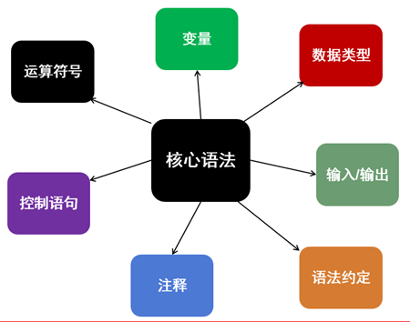
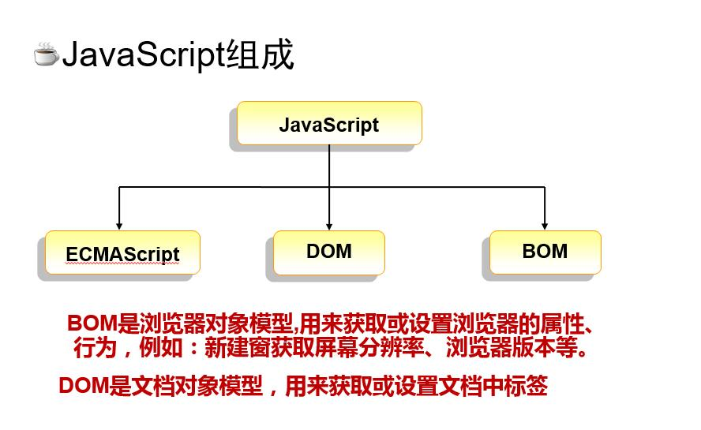

# ## Javascript核心语法



JS组成（浏览器）



## JavaScript核心语法


## 为什么要学习js

​	表单验证

​	页面动态效果

​	动态改变页面的内容

​	

网页的三个组成部分

​	html  内容

​	css   样式

​	js   交互


什么是js

​	js是运行在浏览器上的脚本语言

​	js是一种直译式的，弱类型的脚本语言


ECMA

​	ECMAscript 6 2015

Video

Audio

​	autoplay


ES6 语法糖


脚本的基本结构

```javasc
<script type='text/javascript'>
	//js代码
<script>

```


## hello world


## for循环


## 导入外部的js


## js核心语法

## 变量

​	在运行时可以改变的量


变量相关的基本概念

​	什么是变量

​	什么是声明

​		`var foo;`

​	什么是赋值

​		`foo=100;`

​	声明同时进行赋值

​		var bar = 'hello world';

## 数据类型

###　基础数据类型

​	number string boolearn 

​	特殊： undefined null

### 引用数据类型

```

```

​	

​	什么是变量数据类型

​	   变量可以保存不同类型的数据信息

```
	var a = 1;

	var b = '男'; //字符串必须用'或"括起来

	var c = true;
	var d = false;
//特殊类型
undefined null
```

### 输出输入

浏览器环境

输出

document.write()

console.log()

alert()

输入

input

confirm() 确认窗口

prompt() //输入框

## 注释

1. 单行注释

   `//注释的类型`

2. 多行注释 

   ```
   /**
   多行注释的类型
   */
   ```

## 运算符

1. 算术运算符

   `+ - * / %`

   两个特殊算术运算符 `++ --`

2. 关系运算符

   `> < >= <= == != === !==`

3. 逻辑运算符

   `&& || !`

   &&： 两个为真，则为真，其他为假

   ||：两个为假，则为假，其他为真

   ！：取反

4. 赋值运算符

   `= += -= *= /* %=`

   var a=1;

   a = true;

   `a*=10; //a = a*10`

   a-=5;

5. 其他

   `+` 字符串连接符

   `, var a,b;`

   三元运算符 `条件?条件成立:条件不成立` 

6. 位运算符


