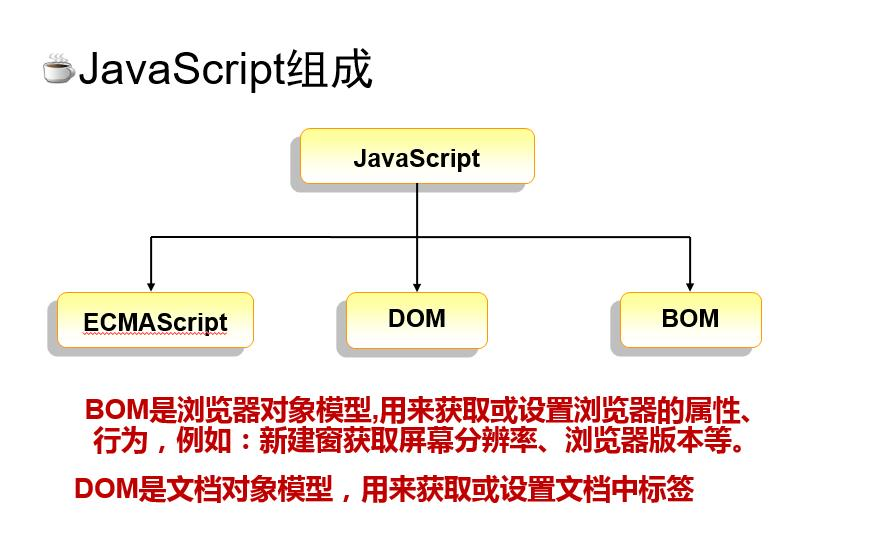

# ## Javascript核心语法


JS组成（浏览器）



## JavaScript核心语法


## 为什么要学习js

​	表单验证

​	页面动态效果

​	动态改变页面的内容

​	

网页的三个组成部分

​	html  内容

​	css   样式

​	js   交互


什么是js

​	js是运行在浏览器上的脚本语言

​	js是一种直译式的，弱类型的脚本语言


ECMA

​	ECMAscript 6 2015

Video

Audio

​	autoplay


ES6 语法糖


脚本的基本结构

```javasc
<script type='text/javascript'>
	//js代码
<script>

```


## hello world


## for循环


## 导入外部的js


## js核心语法

## 变量

​	在运行时可以改变的量


变量相关的基本概念

​	什么是变量

​	什么是声明

​		`var foo;`

​	什么是赋值

​		`foo=100;`

​	声明同时进行赋值

​		var bar = 'hello world';

​	什么是变量数据类型

​	   变量可以保存不同类型的数据信息

```
	var a = 1;

	var b = '男'; //字符串必须用'或"括起来

	var c = true;
	var d = false;
//特殊类型
undefined null
```


​				


